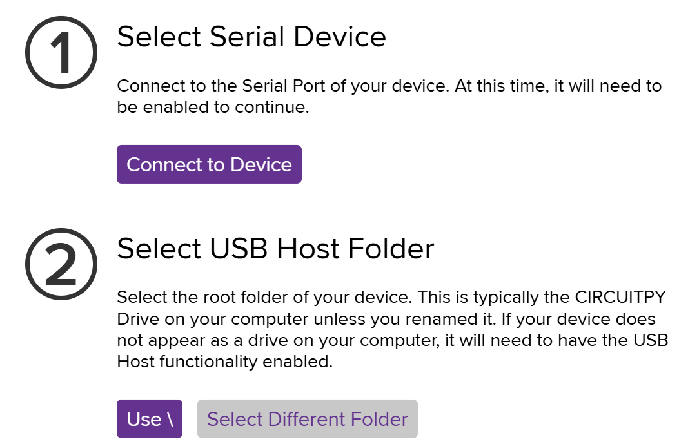
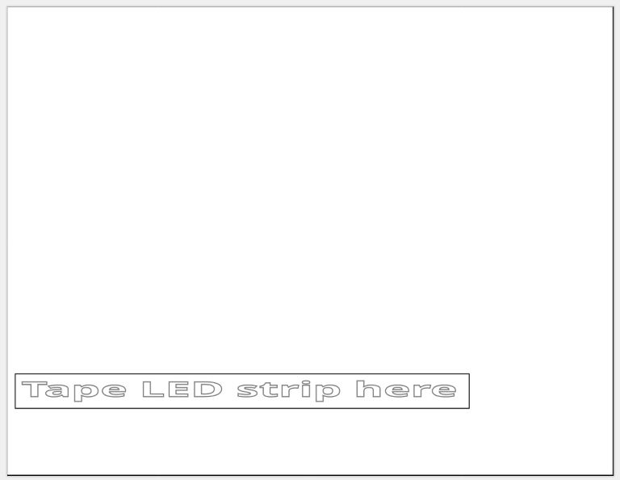

# Pi Pico Lamp
Student project to create a lamp with custom colors using a Pi Pico

## Overview
This project is intended to create a very simple, paper based lamp from a Pi Pico and a couple addressable LEDs. It will use Circuit Python to be easy and fit into a Python class in less than two hours. To accomplish this, Circuit Python will be preloaded (along with all the libraries we will be using) and the board will be pre-soldered with the LED strip. As such, that will not be included in these instructions

## What You Have Been Given
* Pi Pico (either a 2 or a 2W)
* Attached LED strip (6 on the 2 or 4 on the 2W)
* A piece of paper with some cutout outlines
* Some clear tape
* A micro USB cable

## Connecting the Pi Pico
The first thing we will do is just to plug your computer and make sure it is both running and is ready for Circuit Python programming. Do the following:
1. Plug the small, micro USB end of the cable into the fitting slot on the Pi Pico
2. Plug the large, USB A plug into the computer (use a C to A converter if you don't have an available USB A slot)
3. Verify that the green LED on the Pi Pico itself is blinking. None of the other LEDs should light up at this point
4. Verify that a **CIRCUITPY** drive has mounted. If this step will not work on the computer you have, use one of the loaner systems

## Load a Python test for the LED Strip
Now that your Pi Pico is verified as working, we are going to load a simple script to test that all the LEDs are working and that we can push a script to the Pico.
1. With your web browser, go to [code.circuitpython.org/](https://code.circuitpython.org/)
2. Choose **USB** from the buttons that appear (since this connection method will work with either of the boards you may have)
3. Select **Connect to Device** in the Select Serial Device step
4. You should get a pop-up asking which port to let the web page connect to. Choose the one that contains **CircuitPython** in the name
5. After a snake circles on the screen for a couple seconds, choose **Select New Folder** from the next pop-up window (we will use the USB drive to pass over the code)
6. In the drive selection pop-up, select the *CIRCUITPY* drive and then click the **Select Folder** button
7. If you get a security confirmation to allow access to this drive, click **Allow on Every Visit** or the closest thing you see to that
8. Now the pop-up should look something like  
  
Click the **Use \ ** button
9. The CircuitPython editor should now be showing. Click on the first line to get an input cursor and paste in the following text:  
```
import board
import neopixel
 
# Update this to match the number of NeoPixel LEDs connected to your board.
num_pixels = 6

pixels = neopixel.NeoPixel(board.GP0, num_pixels)
pixels.brightness = 0.5

while True:
    pixels.fill((255, 0, 0))
```
10. Change the `num_pixels =` value to 4 if you only have four addressable LEDs attached to your board
11. Click the gray, **Serial** button on the bottom, so we can see the serial output
12. Click the **Save + Run** button near the top
13. You will get a pop-up to select the file to overwrite. Choose the **code.py** file and then click the **Save** button
14. You may get a pop-up asking if you want to overwrite the file, click the **Yes** button or the affirmative selection you see

The board should automatically restart and all your LEDs should light up red

## Another Example
This example is bundled with the NeoPixel library and should put a rainbow effect on your LED strip  
1. Replace the code in the CircuitPython code window with the following:
```
import time
import board
import neopixel

NUMPIXELS = 6  # Update this to match the number of LEDs.
SPEED = 0.05  # Increase to slow down the rainbow. Decrease to speed it up.
BRIGHTNESS = 0.2  # A number between 0.0 and 1.0, where 0.0 is off, and 1.0 is max.
PIN = board.GP0  # This is the default pin on the 5x5 NeoPixel Grid BFF.

pixels = neopixel.NeoPixel(PIN, NUMPIXELS, brightness=BRIGHTNESS, auto_write=False)

def colorwheel(pos):
    """Generate rainbow colors across 0–255 positions."""
    if not (0 <= pos <= 255):
        return 0, 0, 0  # Return black for out-of-range inputs
    if pos < 85:
        return (255 - pos * 3, pos * 3, 0)
    elif pos < 170:
        pos -= 85
        return (0, 255 - pos * 3, pos * 3)
    else:
        pos -= 170
        return (pos * 3, 0, 255 - pos * 3)


def rainbow_cycle(wait):
    for color in range(255):
        for pixel in range(len(pixels)):
            pixel_index = (pixel * 256 // len(pixels)) + color * 5
            pixels[pixel] = colorwheel(pixel_index & 255)
        pixels.show()
        time.sleep(wait)


while True:
    rainbow_cycle(SPEED)

```
2. Check your `NUMPIXELS =` value
3. Click the **Save + Run** button near the top

The board should now display the rainbow effect

## Final Example
This example if from a *fake fire* project to show a video of a fire and then run an LED strip behind the screen to look like fire. It's a good example of setting colors pixel-by-pixel
1. Replace the code in the CircuitPython code window with the following:  
```
import board
import neopixel
from time import sleep
from random import choice

PIN = board.GP0
num_pix = 6 #Number of LEDs
# Define our light string object
pixels = neopixel.NeoPixel(PIN, num_pix, brightness=0.4, auto_write=False)

# Try just setting every light to a equal chance of
#  black, red, yellow, orange, black, half-red, half-yellow and half-orange 
while True:
    for x in range(0, num_pix):
        # Black, Red, Yellow or Orange
        r = choice([(0,0,0), (255,0,0), (255,255,0), (255,165,0),
                (150,0,0), (165,78,0), (0,0,0), (165,165,0)])
        pixels[x] = r
    sleep(0.1)
    pixels.show()

```
2. Check your `num_pix =` value
3. Click the **Save + Run** button near the top

## Your Turn
What do you want your lamp to look like. Given the three examples, can you write some code to get the LEDs to do what you want them to?

## Make Your Lamp
This will be pretty lame, but is quick and easy.
1. Tape the LED strip to the paper the long way, about an inch and a half from the long edge and with the solder point for the wires hanging just off the short edge of the page  

2. Roll the page into a cylinder, the long way, with the LED strip inside and at the bottom. Tape the edges in place at both ends to hold the cylinder in place
3. Pinch the end without wires coming out flat, so that the LED strip stays at the bottom, and tape that whole edge flat
4. Pinch and tape just the sides of the other end of the cylinder flat the same direction as the end you just did. The goal is to keep the LED strip on the bottom, but leave a smaller, center cylinder on this end
5. Tape the Pi Pico to the under side so it is hidden and its weight helps keep the LEDs on the bottom  
This is not great, but should give a little diffusion to the light produced by the LED strip

## If You Need More
I have only preloaded the libraries needed for the examples that we ran. If you need additional modules to do what you want, you can go to [https://circuitpython.org/libraries](https://circuitpython.org/libraries) to get them. You will probably need to search for what you need and then copy the matching **mpy** file into the *lib* directory in the CIRCUITPY drive  
If you want to see some other examples of things to do with your Pi Pico, try some of these:  
* [The Drone Bot Workshop](https://dronebotworkshop.com/pi-pico-circuitpython/) Loading CircuitPython is at the top if you find you need to do that and there are some other things you can do besides just LEDs. LOOK OUT, this is an older guide and you will probably need to update an item or two

